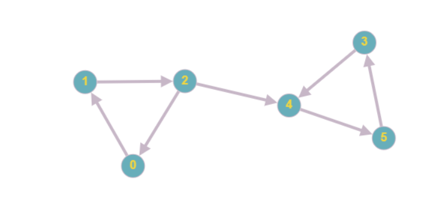

# Immutable Graph TS

A immutable graph management library written in Typescript. The Graph is represented as an adjacency matrix or 2D array. 
The library provides a quick way to create a matrix and some methods to add and remove nodes and edges. 

Sample code: 

```ts
import { Graph, mkEdge, mkPair } from "./graph";

let g = Graph<boolean>(5)

g = g.incr(1)
.setEdge(mkEdge(0, 1), true)

g = g.setEdges(
    mkPair(true, mkEdge(1, 2)), 
    mkPair(true, mkEdge(2, 4)), 
    mkPair(true, mkEdge(2, 0)), 
    mkPair(true, mkEdge(4, 0)),
    mkPair(true, mkEdge(3, 4)), 
    mkPair(true, mkEdge(4, 5)),
    mkPair(true, mkEdge(5, 3)),
)
.removeEdge(mkEdge(4, 0))

console.log(g.stringify(x => x.kind == "none" ? "0" : "1", false))
```

The code above will produce the following matrix: 
```
[
[0, 1, 0, 0, 0, 0,]
[0, 0, 1, 0, 0, 0,]
[1, 0, 0, 0, 1, 0,]
[0, 0, 0, 0, 1, 0,]
[0, 0, 0, 0, 0, 1,]
[0, 0, 0, 1, 0, 0,]
]
```


